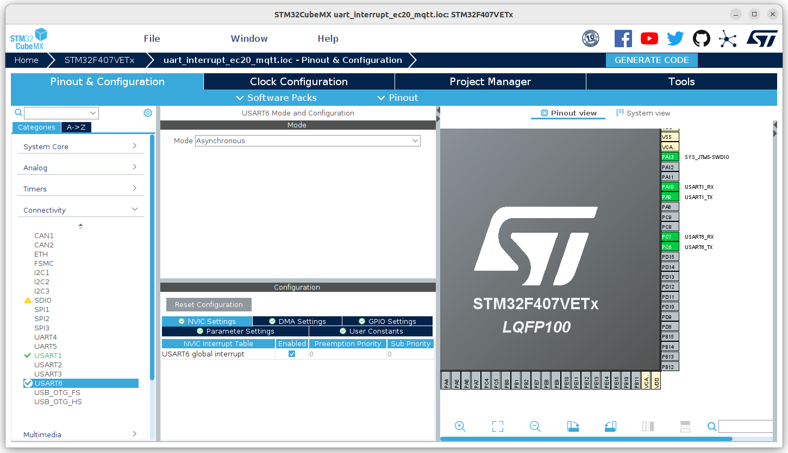

# 这是一个通过STM32CubeMX创建的MQTT工程
## 工程概述
+ stm32通过串口与EC20通信，配置EC20联网、注册mqtt服务器、订阅topic和发送mqtt消息

## 1、创建过程
省略了基本配置，只展示EC20串口中断相关配置，该串口与uart_common_interrupt工程相同

### 1.1、EC20串口中断配置
+ 在Pinout&Configuration->Connectivity选择USART6，NVIC Setting->USART1 global interrupt->Enabled勾选

- 其它设置默认，一般不用修改

### 1.2、生成工程代码
- 点击GENERATE CODE，等待生成工程

## 2、代码分析
只分析EC20驱动部分和mqtt部分代码
### 2.1、文件结构
+ 添加了User目录，把一些用户添加的功能代码放到这个目录下
+ Docs目录下添加了两个文件，是EC20的AT指令文档，分别用于配置EC20联网和通过EC20进行mqtt通信

### 2.2、CMakeFiles.txt
由于添加了新的工程文件，所以需要修改CMakeFiles.txt，把新增的文件添加编译，同时也要修改CMakeFiles_template.txt
+ 修改以下两处，添加同文件搜索目录和编译目标文件目录
```
...
include_directories("User")
...
file(GLOB_RECURSE SOURCES "Core/*.*" "Drivers/*.*" "User/*.*")
```
+ CMakeFiles_template.txt同步修改
```
...
include_directories("User")
...
file(GLOB_RECURSE SOURCES ${sources} "User/*.*")
```

### 2.3、新增的ec20_device.c、ec20_device.h文件修改
把EC20相关的操作，包括串口中断、数据接收处理、EC20联网、EC20注册MQTT、EC20订阅topic和接收mqtt消息等，全部封装在这两个文件内，对外提供几个接口，方便其它模块直接调用即可实现mqtt通信

#### 2.3.1、串口中断和数据接收
对应函数是UartHandle()，与uart_common_interrupt工程相比，增加了EC20注册完成mqtt后的处理逻辑。这部分的流程如下：
+ 初始化时，全局变量initEC20Done=0，串口中断接收的数据保存在receive_buffer_后，重新使能中断接收并直接退出中断， 因为这个时候stm32通过AT指令控制EC20联网、连接MQTT等，直接根据返回数据判断指令执行结果
+ 初始化完成后，EC20联网成功，成功注册MQTT服务器，并订阅对应topic，这时串口中断收到的都是mqtt消息，所以initEC20Done=1，串口中断服务程序需要对接收的数据进行处理。EC20转发过来的mqtt消息都是以0x0D0A结尾的，故以此作为判断，当收到一条完成的mqtt消息后，可以添加处理函数，一般是把消息直接通过消息队列发送给其它模块，中断程序不做过多处理，不过消息队列依靠freertos系统，这里不做介绍。

#### 2.3.2、串口发送
对应函数是ec20_printf，与uart_common_interrupt工程相同，一个简单的串口发送函数

#### 2.3.3、EC20联网、注册MQTT和订阅topic
EC20联网函数是ec20ConnectInternet()，该函数分别做了如下操作：
+ 发送“AT”，等待EC20启动
+ 发送“AT+CSQ”，检查信号强度
+ 发送“ATI”，检查模块版本号
+ 发送“AT+CPIN?”，检查SIM卡是否在位
+ 发送“AT+CREG?”，检查2G网络注册情况
+ 发送“AT+CGREG?”，检查4G网络注册情况
+ 发送“AT+COPS?”，检查运营商信息
+ 发送“AT+QICLOSE=0”，关闭socket连接
+ 发送“AT+QIDEACT=1”，去激活
+ 发送“AT+QIACT=1”，激活
+ 发送“AT+QIACT?”，获取IP地址，如果获取到，说明成功连接网络
+ 备注：各个指令的详细说明可参考文档：Docs/Quectel_EC20 R2.0_AT_Commands_Manual_V1.0.pdf

EC20注册MQTT服务器函数是ec20RegisterMQTT()，该函数分别做了如下操作：
+ 使用“AT+QMTOPEN”指令打开MQTT服务器，设置url、用户名和密码
+ 使用“AT+QMTCONN”指令连接MQTT服务器

EC20订阅topic的函数是ec20SubscribeTopic()，该函数做了如下操作：
+ 使用“AT+QMTSUB”指令定义topic

#### 2.3.4、通过EC20发送MQTT消息
封装了一个名为ec20SendMsg()的函数，调用AT指令“AT+QMTPUBEX”发送MQTT消息到指定topic
+ 备注：mqtt相关的操作指令，可参考文档：Docs/ectel_EC2x&EG9x&EM05_MQTT_Application_Note_V1.0.pdf

### 2.4、main.c文件修改
main.c文件中给出了一套调用ec20_device模块接口的方法，流程如下：
+ 定义要订阅的MQTT topic和要发布的目标topic
+ 定义ec20_device的数据结构，方便传入运营商信息、MQTT服务器信息、topic信息等内容
+ 调用ec20Init()函数，完成EC20联网、MQTT服务器注册和topic订阅
+ 在while循环中，调用ec20SendMsg发送mqtt消息到指定目标topic中